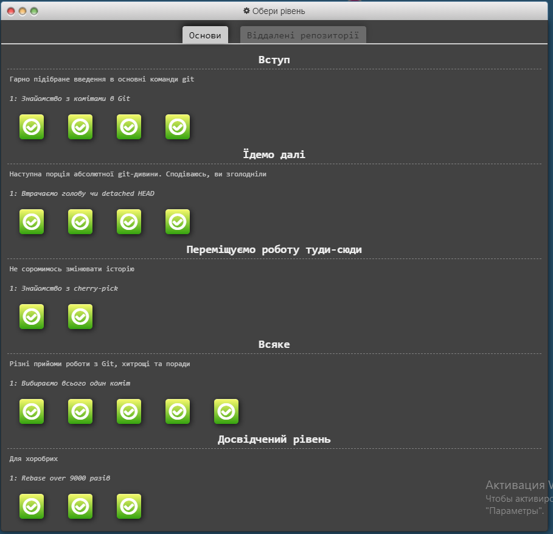
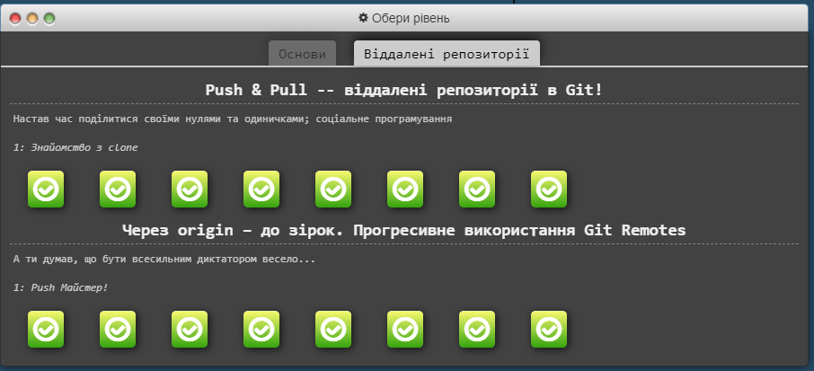
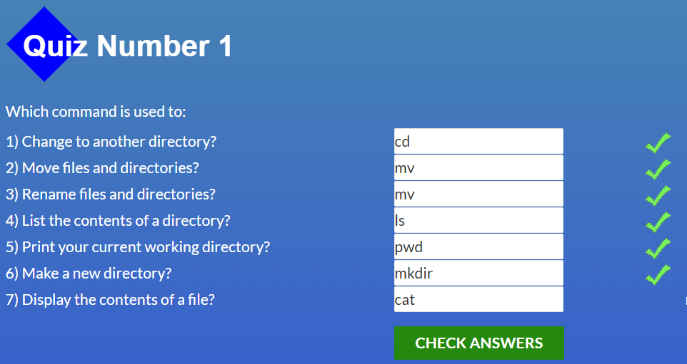
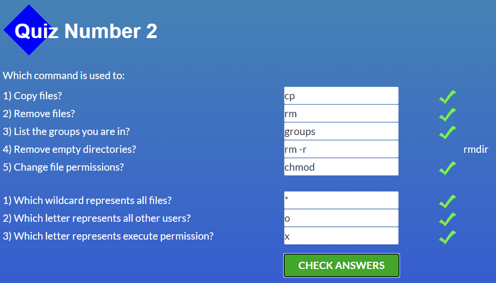
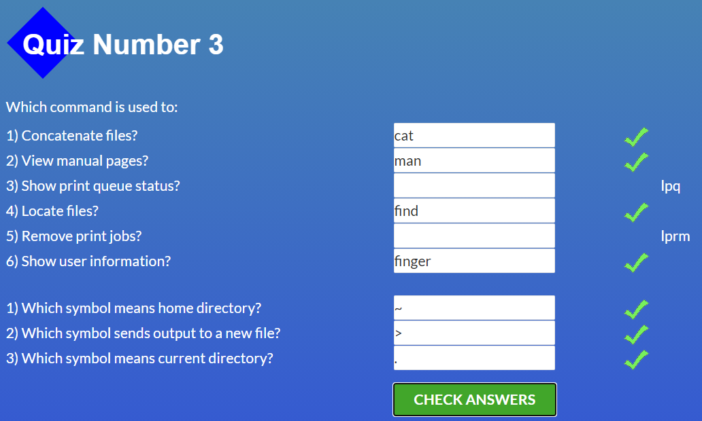
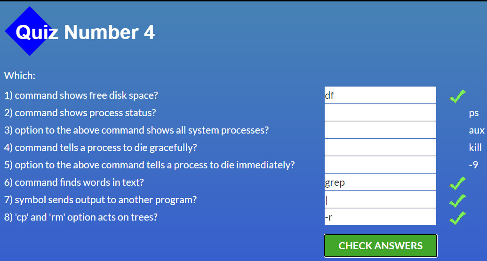

# kottans-frontend

## General
  - [x] [0.Git Basics](https://github.com/kottans/frontend/blob/master/tasks/git-intro.md)
  - [ ] 1.Linux CLI and HTTP
  - [ ] 2.VCS (hello gitty), GitHub and Collaboration
 
 ## Front-End Basics
  - [ ] 3.Intro to HTML & CSS
  - [ ] 4.Responsive Web Design
  - [ ] 5.HTML & CSS Practice
  - [ ] 6.JavaScript Basics
  - [ ] 7.Document Object Model - practice
  
 ## Advanced Topics
  - [ ] 8.Building a Tiny JS World (pre-OOP) - practice
  - [ ] 9.Object oriented JS - practice
  - [ ] 10.OOP exercise - practice
  - [ ] 11.Offline Web Applications
  - [ ] 12.Memory pair game — real project!
  - [ ] 13.Website Performance Optimization
  - [ ] 14.Friends App - real project!

---

## Git Basics
По-перше я дізналася взагалі про його існування,ніколи раніш з ним не зіштовхувалась.  
Як я зрозуміла це программа яка допомагає зберігати нам код в будь який момент який ми захочемо, та відновлювати его якщо ми випадково видалили якись фрагмент.  
Це дуже корисна программа.  
### Я дізналася нові команди:
```
git add . (Додати зміни)
git commid (Зберегти зміни)
git push (Відправити наш код на сайт)
git pull (стягнути зміни з віддаленого репозиторію)
git status (перевірка що в нас є)
git branch (назва віток)
git checkout(перейти на іншу вітку)
git branch -D назва вітки (видалення вітки)
git branch -f название ветки название комита (перемикання гілки на Комміт)
git reset (скасування змін без додаткового коміта)
git revert (скасування змін з додатковим комітом)
git rebase (підтягнути зміни з вітки у іншу вітку)
git rebase -i  коміт,кількість (редагувати коміт в поточній гілці)
git cherry-pick (перенести один коміт поточну гілку)
git commit - - amend (зміна останього коміту)
git tag(унікальні назви коміту)
git describe<ссылка>(показує: найближчий попередній тег в історії, кількість комита (наскільки далеко цей тег в історії) назва)
git bisect(пошук багів)
git merge название ветки (об'єднує гілки з поточної гілкою створюючи новий комміт)
git origin/<ім‘я віддаленої гілки>
Наприклад: origin/master-то ім‘я гілки — це master, а ім‘я віддаленого репозиторію origin
git fetch-ця команда витягує дані з віддаленого репозиторію 
git fetch виконує дві основні дії:
•звантажує коміти,які містять віддалене сховище,але яких немає в локальному сховищі 
•оновлює посилання віддаленого бранчу(наприклад origin/master)
git push(використовується для надсилання локальних змін на вказаний віддалений репозиторій)
git pull(git fetch + git merge)
git pull  - -rebase git push(оновити та запущити свої зміни)
git branch -u(спосіб вказати за якою віддаленою гілкою слідкувати)
Аргументи в git push:
git push <remote> <place>
Параметр <place>:
Приклад --> git fetch origin master (git піде у віддалену гілку master, візьме всі коміти, яких не має локально і закине їх в локальну гілку origin/master)
```

  <details>
    <summary>
     screenshot
    </summary>
    
    
  </details>
  
---
## Linux, командная строка, инструменты HTTP
Ця тема виявилась для мене доволі тяжкою.   
Я дивилася відео по основним командам Linux, тому деякі команди в Quiz мені були не відомі, проте за потребою я їх нагуглю.  

### Я вивчила ось такі команди:
```
ls(виводить список наших файлів)
ls -l (виводить список файлів в стовбчик)
cd (змінює робочу директорію,переходить в інший каталог)
cp(виконує копіювання файлів із одного місця в інше)
cp -r (для копіювання директорії)
mv(виконує переміщення файла в нове місце або переіменування файла)
mkdir назва диреткорії(для створення диреткорії)
rm(виконує видалення файла)
rm -r(для видалення пустої директорії)
rm -rf(для видалення директорії з файлами)
cat путь до файла  (виводить на екран все, що є у нас в файлі або обєднує файли)
man ls(подивитися інформацію про команди)
history(для виводу історії команд)
Для того щоб виконати якусь команду із історії необхідно —> написати !143(будь яке число)
sudo пароль(права адміністратора)
.-текущая директорія 
..- минула директорія
```

  <details>
    <summary>
     screenshot
    </summary>
    
    
    
    
  </details>
  
---