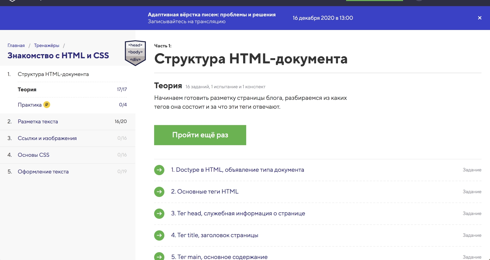

# kottans-frontend

## General
  - [x] [0.Git Basics](https://github.com/kottans/frontend/blob/master/tasks/git-intro.md)
  - [x] [1.Linux CLI and HTTP](https://github.com/kottans/frontend/blob/master/tasks/linux-cli-http.md)
  - [X] [2.VCS (hello gitty), GitHub and Collaboration](https://github.com/kottans/frontend/blob/master/tasks/git-collaboration.md)
 
 ## Front-End Basics
  - [x] [3.Intro to HTML & CSS](https://github.com/kottans/frontend/blob/master/tasks/html-css-intro.md)
  - [x] [4.Responsive Web Design](https://github.com/kottans/frontend/blob/master/tasks/html-css-responsive.md)
  - [ ] 5.HTML & CSS Practice
  - [x] [6.JavaScript Basics](https://github.com/kottans/frontend/blob/master/tasks/js-basics.md)
  - [x] [7.Document Object Model - practice](https://github.com/kottans/frontend/blob/master/tasks/js-dom.md)
  
 ## Advanced Topics
  - [ ] 8.Building a Tiny JS World (pre-OOP) - practice
  - [ ] 9.Object oriented JS - practice
  - [ ] 10.OOP exercise - practice
  - [ ] 11.Offline Web Applications
  - [ ] 12.Memory pair game — real project!
  - [ ] 13.Website Performance Optimization
  - [ ] 14.Friends App - real project!

---

## Git Basics
По-перше я дізналася взагалі про його існування,ніколи раніш з ним не зіштовхувалась.  
Як я зрозуміла це программа яка допомагає зберігати нам код в будь який момент який ми захочемо, та відновлювати его якщо ми випадково видалили якись фрагмент.  
Це дуже корисна программа.  
### Я дізналася нові команди:
```
git add . (Додати зміни)
git commid (Зберегти зміни)
git push (Відправити наш код на сайт)
git pull (стягнути зміни з віддаленого репозиторію)
git status (перевірка що в нас є)
git branch (назва віток)
git checkout(перейти на іншу вітку)
git branch -D назва вітки (видалення вітки)
git branch -f название ветки название комита (перемикання гілки на Комміт)
git reset (скасування змін без додаткового коміта)
git revert (скасування змін з додатковим комітом)
git rebase (підтягнути зміни з вітки у іншу вітку)
git rebase -i  коміт,кількість (редагувати коміт в поточній гілці)
git cherry-pick (перенести один коміт поточну гілку)
git commit - - amend (зміна останього коміту)
git tag(унікальні назви коміту)
git describe<ссылка>(показує: найближчий попередній тег в історії, кількість комита (наскільки далеко цей тег в історії) назва)
git bisect(пошук багів)
git merge название ветки (об'єднує гілки з поточної гілкою створюючи новий комміт)
git origin/<ім‘я віддаленої гілки>
Наприклад: origin/master-то ім‘я гілки — це master, а ім‘я віддаленого репозиторію origin
git fetch-ця команда витягує дані з віддаленого репозиторію 
git fetch виконує дві основні дії:
•звантажує коміти,які містять віддалене сховище,але яких немає в локальному сховищі 
•оновлює посилання віддаленого бранчу(наприклад origin/master)
git push(використовується для надсилання локальних змін на вказаний віддалений репозиторій)
git pull(git fetch + git merge)
git pull  - -rebase git push(оновити та запущити свої зміни)
git branch -u(спосіб вказати за якою віддаленою гілкою слідкувати)
Аргументи в git push:
git push <remote> <place>
Параметр <place>:
Приклад --> git fetch origin master (git піде у віддалену гілку master, візьме всі коміти, яких не має локально і закине їх в локальну гілку origin/master)
```

  <details>
    <summary>
     screenshot
    </summary>
    
    
  </details>
  
---
## Linux CLI, and HTTP
Ця тема виявилась для мене доволі тяжкою.   
Я дивилася відео по основним командам Linux, тому деякі команди в Quiz мені були не відомі, проте за потребою я їх нагуглю.    

Щодо HTTP, для мене було все в ньому невідоме.Я дізналась, що в Google Chrome є інтструменти розробника і там є вкладка Network в якій можна подивитися усі данні про сайт, включаючи HTTP запити. 
### Я вивчила ось такі команди:
```
ls(виводить список наших файлів)
ls -l (виводить список файлів в стовбчик)
cd (змінює робочу директорію,переходить в інший каталог)
cp(виконує копіювання файлів із одного місця в інше)
cp -r (для копіювання директорії)
mv(виконує переміщення файла в нове місце або переіменування файла)
mkdir назва диреткорії(для створення диреткорії)
rm(виконує видалення файла)
rm -r(для видалення пустої директорії)
rm -rf(для видалення директорії з файлами)
cat путь до файла  (виводить на екран все, що є у нас в файлі або обєднує файли)
man ls(подивитися інформацію про команди)
history(для виводу історії команд)
Для того щоб виконати якусь команду із історії необхідно —> написати !143(будь яке число)
sudo пароль(права адміністратора)
.-текущая директорія 
..- минула директорія
```

  <details>
    <summary>
     screenshot
    </summary>
    
    
    
    
  </details>
  
---  
## Git Collaboration
Я прошла ті завдання ще в першій задачі.
  <details>
    <summary>
     screenshot
    </summary>
    
  </details>
    
---
## Intro to HTML and CSS
Я вивчала HTML, CSS за допомогою сайта https://htmlacademy.ru   
Для того, щоб встигнути пройти інші завдання, я пропустила це завдання.  
Пізніше я повернусь до нього.
  <details>
    <summary>
     screenshot
    </summary>
    
    
    
  </details>    

---  
## Responsive Web Design
Адаптивним веб-дизайном називать дизайн, що забезпечує оптимальне відображення та взаємодію сайту з користувачем, тобто візуальний вигляд сайту на різних пристроях.  
### Я вивчила ось такі команди:
```
justify-content(визначає, як браузер розподіляє простір між та навколо елементів контенту уздовж):
flex-start(елементи вирівнюються по лівій стороні контейнера)
flex-end(елементи вирівнюються по правій стороні контейнера)
center(елементи вирівнюються по центру контейнера)
space-between(елементи буде зображено з рівними відступами поміж них)
space-around(елементи буде зображено з рівними відступами навколо них)  
    

align-items(вирівнює елементи вертикально):
flex-start(елементи вирівнюються за верхнім краєм контейнеру)
flex-end(елементи вирівнюються за нижнім краєм контейнеру)
center(елементи вирівнюються вертикально по середині контейнеру)
baseline(елементи буде розміщено на базовій лінії контейнера)
stretch(елементи розтягуються заповнюючи контейнер)  
  
  
flex-direction(визначає напрямок елементів в контейнері):
row(елементи розташовані так само як напрямое тексту)
row-reverse(елементи розташовані протилежно напряму тексту)
column(елементи розташовані с гори до низу)
column-reverse(елементи розташовані з низу до гори)  

  
order(типове значення властивості в елементах дорівнює 0, але ми можемо змінити значення на додатнє або від'ємне ціле число)    
  
    
align-self(властивість котру ти застосовуєш до окремого елементу)
такі ж самі властивості як у align-items  
   
     
flex-wrap(задає правила виведення flex-елементів - в один рядок або в кілька, з переносом блоків):
nowrap(кожен елемент буде розташований одим за одним в одному рядку)
wrap(елементи переносятся до наступного рядка)
wrap-reverse(елементи преносяться дот наступного рядка у зворотньому порядку)  
  
    
flex-direction+flex-wrap=flex-flow  
  
      
align-content(визначає інтервал поміж рядками):
flex-start(рядки буде розташовано вгорі контейнеру)
flex-end(рядки буде розташовано внизу контейнеру)
center(рядки групуються вертикально по центру контейнеру)
space-between(рядки розташовуються з однаковими проміжками навколо них)
space-around(рядки розташовуються з однаковими проміжками між ними)
stretch(рядки розтягуються заповнюючи контейнер рівномірно)
```
  <details>
    <summary>
     screenshot
    </summary>
    
    
  </details>  

---
## JS Basics
  Ця тема була для мене досить знайомою, я вивчала її раніш за посиланням: https://htmlacademy.ru . Тому відео уроки пропустила і пішла віконувати завдання.Проте ваш курс зміг мене здивувати, я дізналась купу нових команд, які обов'язково буду використовувати в мвйбутньому.
### Ось список команд які були для мене новими:
```
.push()-додає один або більше елементів в кінець масиву і повертає нову довжину масиву.
.pop()-видаляє останній елемент з масиву і повертає його значення.
.shift()-видаляє перший елемент з масиву і повертає його значення. Цей метод змінює довжину масиву.
.unshift()-додає один або більше елементів в початок масиву і повертає нову довжину масиву. 

switch()-обчислює вираз , відповідність значення виразу в case реченні, і виконує оператори , пов'язані з цим case, а також заяви в case, які слідують за узгодження case.
Синтаксис:  
switch(lowercaselLetter) {
  case "a":
  console.log("A");
  break;
}  

.hasOwnProperty()-Метод повертає логічне значення , яке вказує , чи має об'єкт зазначеного властивості в якості свого власного майна.  

Math.random()-функція може певернути 0, але ніколи на поверне 1. 

Odject.freeze()-Метод заморожує об'єкт. Заморожений предмет більше не можна змінювати; заморожування об'єкта перешкоджає додаванню до нього нових властивостей, видаленню існуючих властивостей, запобігає зміні перелічуваності, конфігурації або запису до наявних властивостей та запобігає зміні значень існуючих властивостей.  

rest(...arr)-

.apply()- для обчислення максимального значення в масиві.

Math.max()-Функція повертає найбільше з нуля або більше цифр , наведених в якості вхідних параметрів.  

class- новий синтаксис створення об'єктів.

new-дозволяє розробникам створювати екземпляр визначається користувачем типу об'єкта або одного з вбудованих типів об'єктів, має функцію конструктора.
Синтаксис:
function Car(make, model, year) {
  this.make = make;
  this.model = model;
  this.year = year;
}
const car1 = new Car('Eagle', 'Talon TSi', 1993);  

import-дозволяє вибрати, які частини файлу або модуля завантажувати.
Синтаксис:
import { add } from "/";(поштрення .js)
import * as-допомагає імпортувати весь вміст файлу у поточний файл.
Синтаксис:
import * as  myMathModule  from "/";(поштрення .js)  

export default-експортує лише одне значення.
Синтаксис:
exrort default function add(x, y) {
  return x + y;
}  

promise(має три стани pending, fulfilled, rejected)-це функція конструктор.(resolve and reject-параметри)

.then()-метод виконується відразу ж після того як ваше promise виконано з resolve. 

.catch()-метод який використовується, коли вашу promise відхилено.  

.test()-метод приймає регулярний вираз, застосовує його рядок.

-i прапор який ігнорує регістр.  

.match()-метод, застосовує метод до рядка та передає регулярний вираз усередині дужок.  

.pop()-вилучає елемент з кінця масиву.
.shift()-вилучає елемент з початку масиву.  

.slice()-дозволяє видалити будь-яку кількість послідовних елементів з будь-якого місця масиву.  

.idexOf()-приймає елемент як параметр і при його виклику повертає позицію або індекс цього елемента або -1 якщо елемент не існує в масиві.    

object.keys()-масив, який містить усі ключі, що зберігаються в об'єкті і передаючи об'єкт як аргмент.
```
  <details>
    <summary>
     screenshot
    </summary>
    
    
    
  </details>  

---
## DOM
В цьому розділі я вивчила, що таке DOM.Тема доволі складна і мені довелося пропустити 2 завдання і піти далі, щоб встигнути зробити Post OOP, але я обов'язково до нього повернусь.
  <details>
    <summary>
     screenshot
    </summary>
    
  </details>    

[Demo](https://ania-leichenko.github.io/kottans-frontend-dom/) | [Code base](https://github.com/ania-leichenko/kottans-frontend-dom)

---
## Tiny JS World
[Demo](https://ania-leichenko.github.io/a-tiny-JS-world/) | [Code base](https://github.com/ania-leichenko/a-tiny-JS-world)